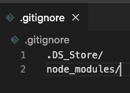

# Homework 9: README Generator | 

## Description
This repository holds the homework assignment for Week 9 of the [The Coding Boot Camp](https://techbootcamps.utexas.edu/coding/) through the University of Texas at Austin's Center for Professional Education.

The scope of this project is to create a command line application that dynamically creates a README from a user's input. This project is using Node.js for the runtime environment and the Inquirer package to prompt the user for input.

## Notes
* One critical component to this project in commiting to GitHub is the use of the ```.gitignore``` folder. Because Node Modules are being used we do not want to commit the modules folder and other non-program specific files.
    > 

## Instructions
To use this project you will need to clone this repository and then open it in your text editor of choice. You will also need access to a CLI. This projected was created using VSCode and then run in the integrated terminal. Assuming that Node.js is already installed, you will need to run ```npm install``` and then you can run ```node index.js``` to launch the application and proceed through the prompts.

## Usage
Here is a video walkthrough of the project.

## Page Screenshots
The generated README from running this application. Find the actual README by clicking [here](https://github.com/ryanrotman/homework-9-good-README-generator/tree/master/README_Output) or on the screenshot below.
[](https://github.com/ryanrotman/homework-9-good-README-generator/tree/master/README_Output)

## Contributing
Any and all collaboration is welcome so if you have any suggestions or thoughts for new features, please send me an email at ryan.rotman@gmail.com.